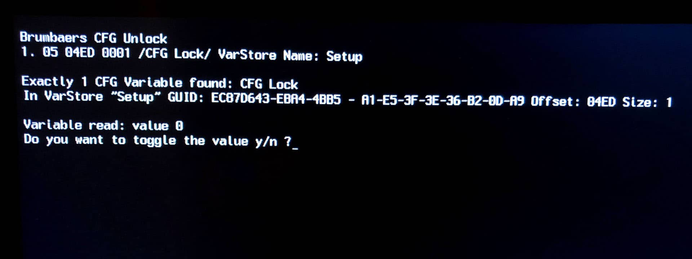
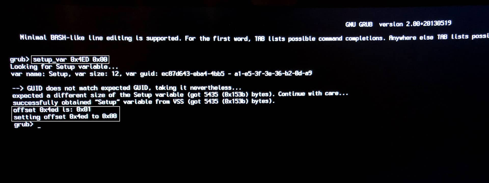
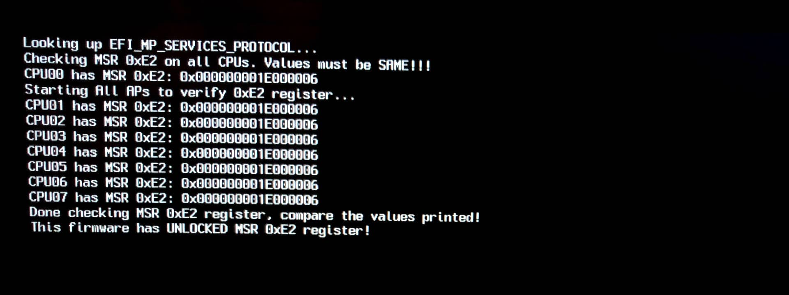

# Dell Optiplex 7050 OpenCore 0.7.9

This repository contains my personal EFI configuration for the fantastic Dell Optiplex 7050.

The current version installed is Monterey 12.2.1 (21D62) with OpenCore 0.7.9.

I use iMac18,1 as my SMBIOS.

This has mostly been created with the help of the [Vanilla Hackintosh Guide by Dortania](https://dortania.github.io/OpenCore-Install-Guide/) and [linkdev's OpenCore config(https://github.com/linkev/Dell-Optiplex-7050-Micro-Hackintosh/).
At the beginning the that config has worked ok for installing the OS onto my HDD. But than I had o remove some kexts and do some changes at the config to get it working on my Optiplex 7050 without any problems.

**MAKE SURE YOU ADD YOUR SYSTEM SERIAL NUMBER, SYSTEM UUID, MLB AND ROM IN PLATFORMINFO BEFORE BOOTING!**

You may also need to remove the AirportBrcmFixup.kext, BrcmBluetoothInjector.kext, BrcmFirmwareData.kext and BrcmPatchRAM3.kext if you are not using a Dell WiFi card or any WiFi at all.

Don't forget to check the NVRAM values as well:
- Remove `-v` after you're fully done installing macOS, to turn off Verbose.
- You need to remove `brcmfx-country=#a` if you are not using a DW1560/DW1820A, but an [Intel WiFi chip instead](https://github.com/OpenIntelWireless/itlwm), or no WiFi at all (just Ethernet).
- Modify `alcid=11` in case your audio chip is different, although I think all of the 7050's I've seen use the same Realtek ALC3234 controller.
- Remove `igfxonln=1` if you have a monitor plugged in all the time (not a dummy dongle, not sure if this flag helps anything really).

Double/triple check everything to make sure, its a relatively light setup, but better safe than sorry!

## Hardware Configuration

- Intel i7-7700 CPU
- 16GB RAM DDR4 Kingston 2400 MHz
- AMD R7 450 (Shows up as HD 8830M but works without any problem)
- WD Blue 1TB HDD 
- TP-Link Archer T2u Nano Wifi
- TP-Link UB400 Bluetooth
- Intel I219-LM Gigabit Ethernet
- Integrated speaker at the front, works perfectly with `alcid=11`
- 1 addon Displayport port, works in Windows, doesn't work in macOS, came with the specific Optiplex I bought
- 1 USB-C Port and 1 USB-A port at the front
- 1 headphone jack and 1 microphone port at the front
- 4 USB-A ports at the back
- 240 watt Dell power supply

## What works and what doesn't

### Working

- [x] APFS
- [x] CPU power management
- [x] GPU acceleration
- [x] Video encoder/decoder hardware
- [x] All USB ports at their max speed
- [x] Gigabit Ethernet
- [x] Secure Boot (Works but I disabled on bios becouse I'm dual booting with Linux)
- [x] Location Services
- [x] Onboard Audio + Integrated Speaker at the front
- [x] iMessage (set your Serial Number, UUID and MLB correctly)
- [x] All iCloud Services
- [x] App Store
- [x] FaceTime
- [x] Handoff
- [x] Unlock with Apple Watch (Not tested)
- [x] AirDrop
- [x] AirPlay
- [x] Continuity
- [x] DRM:
  - iTunes Movies (FairPlay 1)
  - Netflix (FairPlay 2/3)
  - Amazon Prime (FairPlay 2/3)
  - Apple TV+ (FairPlay 4)
- [x] NVRAM
- [x] FileVault
- [x] Dell Sensors (Fans/Temperature)
- [x] Built in Displayport 1.2 and HDMI 1.4
- [x] Sidecar (Not tested)
- [x] Various sharing functions like Content Caching (very useful if you have lots of Apple devices)
- [x] Time Machine
- [x] Seamless software updates
- [x] Monterey's AirPlay to Mac with [FeatureUnlock](https://github.com/acidanthera/FeatureUnlock)
- [x] Sleep/Wake (Works with the AMD R7 450 GPU.) 

### Not Working

- [ ] Sleep/Wake when using the integrated GPU. 

## Using the EFI

Only things you need to set manually is the **System Serial Number**, **System UUID**, **MLB** and **ROM**. I have set them as **{CHANGE ME}** and OpenCore will complain if you do not set them correctly. You can get the first three created with [GenSMBIOS](https://github.com/corpnewt/GenSMBIOS). The ROM part can be your Ethernet or WiFi MAC Address such as E4 85 G6 M8 H9 2Q, for example. Refer to the [Vanilla Hackintosh Guide by Dortania](https://dortania.github.io/OpenCore-Install-Guide/) if you need more help.

## Preparation

- Update to the latest BIOS if you can.
- Once on the latest BIOS, reset it to defaults (maybe even go as far as taking the CMOS battery out for a few minutes to hard reset).
- Make sure CFG Lock is **Disabled**. Alternatively, enable AppleCpuPmCfgLock and AppleXcpmCfgLock in Kernel, however, its better for performance to disable CFG Lock with the UEFI Variables below. You can also use the CFG Lock tool included to find the bit and flip it between Enabled and Disabled. [More info here](https://dortania.github.io/OpenCore-Install-Guide/config.plist/kaby-lake.html#kernel).
- To add to the above point, just use a Sabrent SSD to make your life easy. I never got Samsung/Toshiba drives to work with the installer (they come as default with XPS/Optiplex computers).
- For Big Sur, if you're using Dell Wireless 1560/1820A or something similar, make sure to modify your config [according to the "Please pay attention" section](https://github.com/acidanthera/AirportBrcmFixup#please-pay-attention), otherwise it will take forever to boot into the installer.

## BIOS Settings

[The entire BIOS settings can be found here](BIOS.md)

## UEFI Variables

| Variable name          | Offset | Default value  | Required value  | Description                                                         |
|------------------------|--------|----------------|-----------------|---------------------------------------------------------------------|
| CFG Lock               | 0x4ED  | 0x01 (Enabled) | 0x00 (Disabled) | Disables CFG Lock, otherwise you won't be able to boot              |
| DVMT Pre-Allocated     | 0x795  | 0x01 (32M)     | 0x02 (64M)      | Increases DVMT pre-allocated size to 64M which is required          |
| DVMT Total Gfx Mem     | 0x796  | 0x01 (128M)    | 0x03 (MAX)      | Increases total gfx memory limit to maximum                         |
| Bi-directional PROCHOT | 0x527  | 0x01 (Enabled) | 0x00 (Disabled) | Disables PROCHOT, which limits your CPU to 0.79GHz. More info below |

### Automated way
You can use the tools included to find your hidden CFG Lock value and disable it. These are **CFGUnlock** and **ControlMsrE2**. As of OpenCore 0.6.8, ControlMsrE2 is included and may be used to unlock CFG Lock for systems which have no easy way of doing so. This is a more automated and user-friendly way.

Here is an example of the **CFGUnlock** tool. Boot into OpenCore, choose **CFGUnlock** and follow the instructions:

You will still need to use the manual way below to change the DVMT variables.

### Manual way
The manual way is to boot into OpenCore, choose UEFIModify, type in `setup_var`, the offset and the required value. An example screenshot is below:

The above image is for the CFG Lock value. For DVMT, you would type:

**setup_var 0x795 0x02**

**setup_var 0x796 0x03**

Make sure to restart after any changes, they should apply. You used to be able to check the CFG Lock status with VerifyMsrE2, but since it was replaced by ControlMsrE2, you can use that instead. You'll know if it worked or not, by whether you can boot your installer:

## Miscellaneous thoughts

I have swapped from DW1820A to the DW1560 recently to see if Airdrop/Continuity/Handoff would work better, but I'm just not sure on both of these cards anymore. It seems [itlwm](https://github.com/OpenIntelWireless/itlwm) is making very good progress and you're better off with an Intel card these days. Still, I'll keep it in there since I am connected via Ethernet anyway.

I am using [exelban's Stats](https://github.com/exelban/stats) to monitor CPU, GPU, Memory, Disk, Temperatures, Fan Speed and Network.

This has been a great Plex Server throughout its use, very good Minecraft server too and have Wireguard VPN Server setup with [this guide](https://barrowclift.me/post/wireguard-server-on-macos).

As for the Bi-directional PROCHOT (BDPROCHOT), I've encountered this several times at work with our Dell machines and finally figured out how to stop it or at least suppress it. What happens is either a sensor dies, misinforms the BIOS or just the power supply is crappy and sends signals all over the place which in turn locks your CPU to a low power state.
Sometimes its 0.79GHz, sometimes a little bit higher or lower, but the result is an EXTREMELY slow system.
The computer thinks its essentially on fire and limits everything it can to save itself. However, in reality, the cooling is more than enough and no overheating is ocurring. I've had to replace a few motherboards under warranty to fix this issue before, but I found out that you don't need to do any of that, you just set the variables hidden in the BIOS as shown above. Of course, this remove the temperature checks/protections and could result in your computer overheating, so exercise caution with this option. I'm sure other CPU overheating protections would kick in regardless, but this probably voids your warranty, unless you reset the BIOS completely before sending your computer in.
Rambling aside, I will be making a tutorial on how to find the variable and turn it off and get your CPU speed back up to normal in the future.
